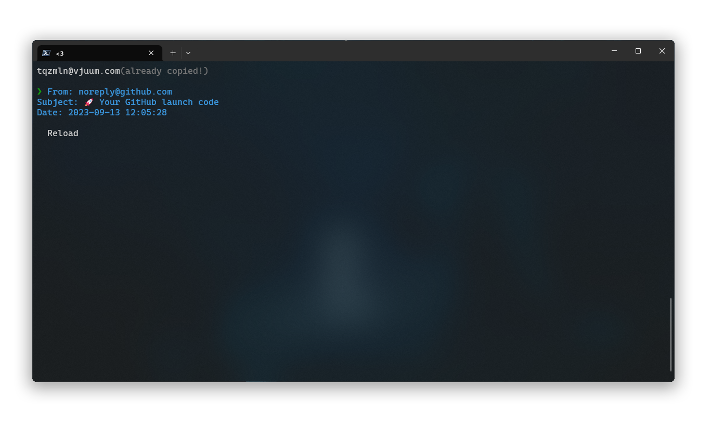
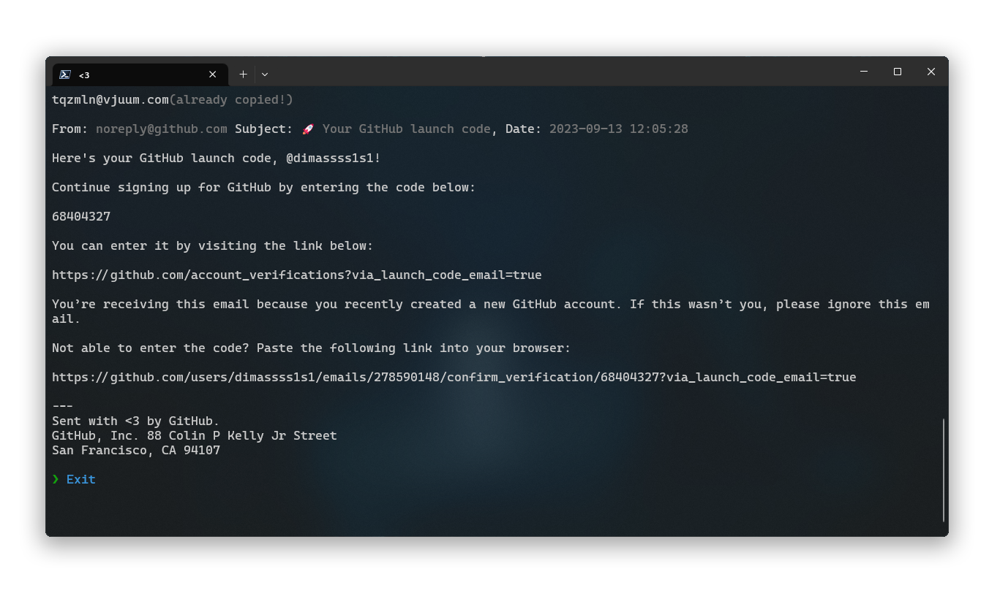

# Tmail
<div style="display: flex; gap: 10px; align-items: start;">
    
    <p>Application for creating temporary email</p>
</div>

## Table of contents
* [Preview](#preview)
* [Installation](#installation)
  * [Windows](#windows)

## Preview



## Installation
### Windows
You can get started by running this in your terminal as administrator
```powershell
curl https://raw.githubusercontent.com/Ja1z666/temp-mail/main/bin/install.ps1 | pwsh
```
or
```powershell
Invoke-Expression (Invoke-RestMethod https://raw.githubusercontent.com/Ja1z666/temp-mail/main/bin/install.ps1)
```
or you can download the installer and run it as administrator
```powershell
curl https://raw.githubusercontent.com/Ja1z666/temp-mail/main/bin/install.ps1 > install.ps1
./install.ps1
``` 
after that just reopen your terminal and type
```
tmail
```
